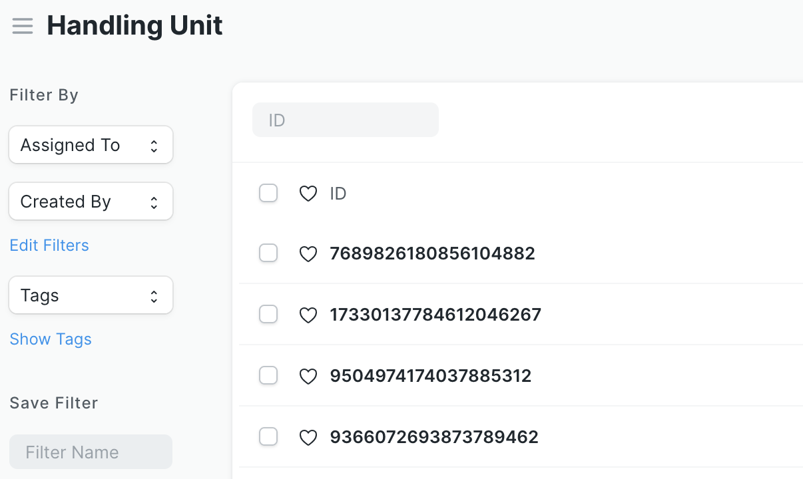

# Handling Unit

A Handling Unit is an abstraction for tracking quantities of items that are moved or stored together. It does not replace Batch or Serial numbers, the manufacture of an Item, or the functionality of the Product Bundle, but can supplement these as a way of conveniently grabbing information that would otherwise require a lot of keystrokes to enter.

By assigning a unique ID to the handling unit, it is possible to capture via scanner the item, net quantity, unit of measure and timestamp of the previous transaction, and then act upon that information in context, according to the [decision matrix](./matrix.md). Beam adds a new doctype, Handling Unit, to implement this functionality in ERPNext.

## Listviews
Generally scanning a Handling Unit in a list view will filter to show all the transactions of the doctype with the appropriate Handling Unit.

## Purchase Receipt 
For Purchase Receipts, Handling Units are generated and cannot be supplied by the user.

| Item             | Warehouse          | Handling Unit  |       Quantity |
| ---------------- | ------------------ | -------------- | --------------:|
| Cocoplum         | Storeroom          |            123 |          40 Ea |

## Purchase Invoice
For Purchase Invoices with "Update Stock" checked, Handling Units are generated and cannot be supplied by the user.

| Item             | Warehouse          | Handling Unit  |       Quantity |
| ---------------- | ------------------ | -------------- | --------------:|
| Cocoplum         | Storeroom          |            123 |          40 Ea |

When "Update Stock" is _not_ checked, they can be scanned to facilitate data entry but there's no effect in the Stock Ledger.

## Delivery Note
For Delivery Note, Handling Units are consumed. In the case where less than the total quantity associated with the Handling Unit is being delivered, the existing handling unit will refer to the remaining (net) quantity.

| Item             | Warehouse          | Handling Unit  |       Quantity |
| ---------------- | ------------------ | -------------- | --------------:|
| Cocoplum         | Storeroom          |            123 |          20 Ea |

Stock Ledger or subsequent transaction
| Item             | Warehouse          | Handling Unit  |       Quantity |
| ---------------- | ------------------ | -------------- | --------------:|
| Cocoplum         | Storeroom          |            123 |          20 Ea |

## Sales Invoice
For a Sales Invoice where "Update Stock" is checked, Handling Units are consumed. In the case where less than the total quantity associated with the Handling Unit is being delivered, the existing handling unit will refer to the remaining (net) quantity.

| Item             | Warehouse          | Handling Unit  |       Quantity |
| ---------------- | ------------------ | -------------- | --------------:|
| Cocoplum         | Storeroom          |            123 |          15 Ea |

Stock Ledger or subsequent transaction
| Item             | Warehouse          | Handling Unit  |       Quantity |
| ---------------- | ------------------ | -------------- | --------------:|
| Cocoplum         | Storeroom          |            123 |          5 Ea |

When "Update Stock" is _not_ checked, they can be scanned to facilitate data entry but there's no effect in the Stock Ledger.

The following screen shot shows the stock ledger for the Cloudberry item. The first row shows the receipt of 60 pounds of the fruit via a Purchase Receipt, and the second row is after the sale of 25 pounds via a Sales Invoice that had 'update stock'. Note that both transactions reference the same Handling Unit.

## Stock Entry

### Material Transfer for Manufacture and Material Transfer

In a case where the entire quantity associated with a Handling Unit is moved from one warehouse to another, that Handling Unit is reused.

| Item             | Warehouse          | Handling Unit  |       Quantity |
| ---------------- | ------------------ | -------------- | --------------:|
| Cocoplum         | Storeroom          |            123 |         -40 Ea |
| Cocoplum         | Work In Progress   |            123 |          40 Ea |

In a case where less than the total quantity associated with a Handling Unit is moved from one warehouse to another, a new handling unit is generated for the new units. Subsequent scans or lookups of the original handling unit (123) will return the remainder or net quantity.

| Item             | Warehouse          | Handling Unit  |       Quantity |
| ---------------- | ------------------ | -------------- | --------------:|
| Cocoplum         | Storeroom          |            123 |         -20 Ea |
| Cocoplum         | Work In Progress   |            456 |          20 Ea |

### Send to Contractor

In a case where the entire quantity associated with a Handling Unit is moved from one warehouse to another, that Handling Unit is reused.

| Item             | Warehouse               | Handling Unit  |       Quantity |
| ---------------- | ----------------------- | -------------- | --------------:|
| Cocoplum         | Storeroom               |            123 |         -40 Ea |
| Cocoplum         | Subcontractor Warehouse |            123 |          40 Ea |

In a case where less than the total quantity associated with a Handling Unit is moved from one warehouse to another, a new handling unit is generated for the new units. Subsequent scans or lookups of the original handling unit (123) will return the remainder or net quantity.

| Item             | Warehouse               | Handling Unit  |       Quantity |
| ---------------- | ----------------------- | -------------- | --------------:|
| Cocoplum         | Storeroom               |            123 |         -20 Ea |
| Cocoplum         | Subcontractor Warehouse |            789 |          20 Ea |

### Repack and Manufacture

In the case of a Repack, Material Issue or Material Consumption for Manufacture, a new Handling Unit is generated for the new quantities. 

| Item             | Warehouse          | Handling Unit  |       Quantity |
| ---------------- | ------------------ | -------------- | --------------:|
| Cocoplum         | Storeroom          |            123 |       	 -40 Ea |
| Cocoplum         | Storeroom          |            789 |    1 Box of 40 |

In a case where less than the total quantity associated with a Handling Unit is consumed, subsequent scans or lookups of the original handling unit (123) will return the remainder or net quantity.

| Item             | Warehouse          | Handling Unit  |       Quantity |
| ---------------- | ------------------ | -------------- | --------------:|
| Cocoplum         | Storeroom          |            123 |       	 -20 Ea |
| Cocoplum Puree   | Work In Progress   |            012 |        1 liter |
| Cocoplum         | Scrap              |                |           1 Ea |

A feature is planned to allow setting the BOM Scrap Item to toggle if a handling unit should be created.

### Material Issue, Material Consumption for Manufacture

In both these cases, there is no offsetting movement or creation of items.

| Item             | Warehouse          | Handling Unit  |       Quantity |
| ---------------- | ------------------ | -------------- | --------------:|
| Cocoplum         | Storeroom          |            123 |         -20 Ea |

| Item             | Warehouse          | Handling Unit  |       Quantity |
| ---------------- | ------------------ | -------------- | --------------:|
| Cocoplum         | Work In Progress   |            123 |         -20 Ea |

### Material Receipt
In the case of Material Receipt, a new Handling Unit is generated for each item. 

| Item             | Warehouse          | Handling Unit  |       Quantity |
| ---------------- | ------------------ | -------------- | --------------:|
| Cocoplum         | Storeroom          |            123 |          20 Ea |
