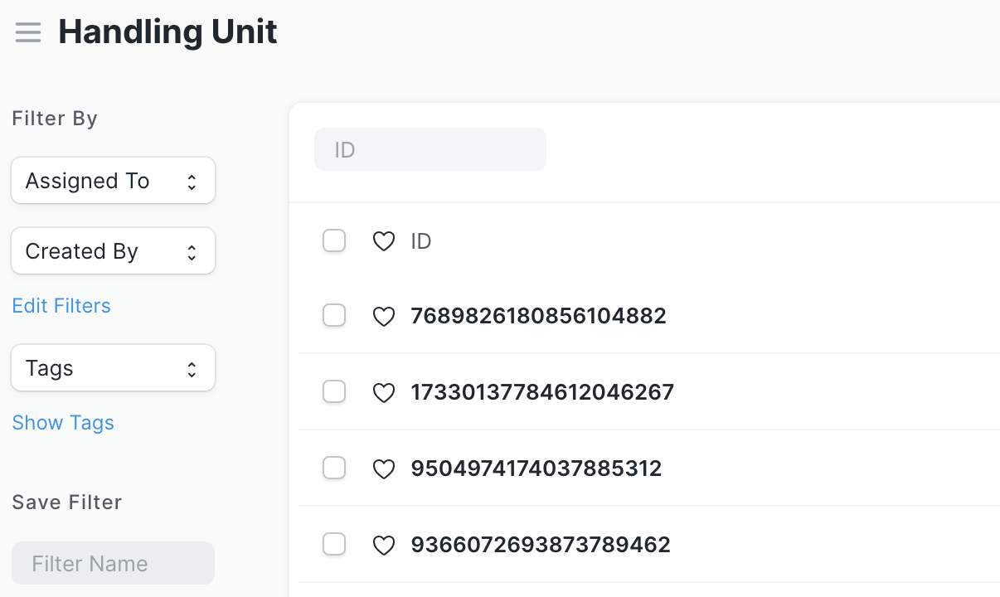
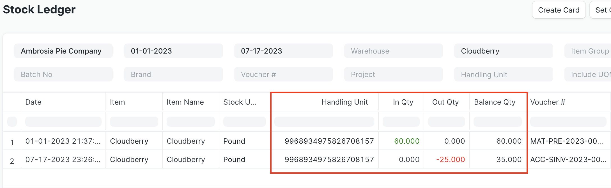
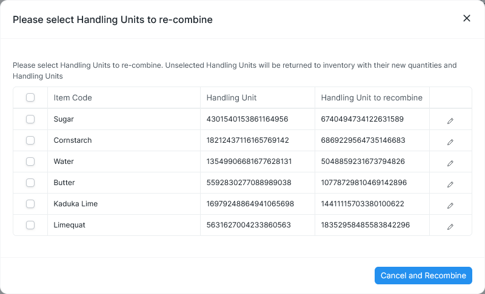
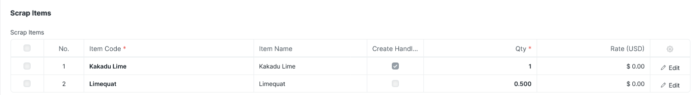

<!-- Copyright (c) 2025, AgriTheory and contributors
For license information, please see license.txt-->

# Handling Unit

  AgriTheory 2026-02-08

A Handling Unit is an abstraction for tracking quantities of items that are moved or stored together. It does not replace Batch or Serial numbers, the manufacture of an Item, or the functionality of the Product Bundle, but can supplement these as a way of conveniently grabbing information that would otherwise require a lot of keystrokes to enter.

By assigning a unique ID to the Handling Unit, it is possible to capture via scanner the item, net quantity, unit of measure and timestamp of the previous transaction, and then act upon that information in context, according to the [decision matrix](./matrix.md). Beam adds a new doctype, Handling Unit, to implement this functionality in ERPNext.

## Listviews
Generally scanning a Handling Unit in a list view will filter to show all the transactions of the doctype with the appropriate Handling Unit.

## Purchase Receipt 
For Purchase Receipts, Handling Units are generated and cannot be supplied by the user.

| Item             | Warehouse          | Handling Unit  |       Quantity |
| ---------------- | ------------------ | -------------- | --------------:|
| Cocoplum         | Storeroom          |            123 |          40 Ea |

## Purchase Invoice
For Purchase Invoices with "Update Stock" checked, Handling Units are generated and cannot be supplied by the user.

| Item             | Warehouse          | Handling Unit  |       Quantity |
| ---------------- | ------------------ | -------------- | --------------:|
| Cocoplum         | Storeroom          |            123 |          40 Ea |

When "Update Stock" is _not_ checked, they can be scanned to facilitate data entry but there's no effect in the Stock Ledger.

## Delivery Note
For Delivery Note, Handling Units are consumed. In the case where less than the total quantity associated with the Handling Unit is being delivered, the existing Handling Unit will refer to the remaining (net) quantity.

| Item             | Warehouse          | Handling Unit  |       Quantity |
| ---------------- | ------------------ | -------------- | --------------:|
| Cocoplum         | Storeroom          |            123 |          20 Ea |

Stock Ledger or subsequent transaction
| Item             | Warehouse          | Handling Unit  |       Quantity |
| ---------------- | ------------------ | -------------- | --------------:|
| Cocoplum         | Storeroom          |            123 |          20 Ea |

## Sales Invoice
For a Sales Invoice where "Update Stock" is checked, Handling Units are consumed. In the case where less than the total quantity associated with the Handling Unit is being delivered, the existing Handling Unit will refer to the remaining (net) quantity.

| Item             | Warehouse          | Handling Unit  |       Quantity |
| ---------------- | ------------------ | -------------- | --------------:|
| Cocoplum         | Storeroom          |            123 |          15 Ea |

Stock Ledger or subsequent transaction
| Item             | Warehouse          | Handling Unit  |       Quantity |
| ---------------- | ------------------ | -------------- | --------------:|
| Cocoplum         | Storeroom          |            123 |          5 Ea |

When "Update Stock" is _not_ checked, they can be scanned to facilitate data entry but there's no effect in the Stock Ledger.

The following screen shot shows the stock ledger for the Cloudberry item. The first row shows the receipt of 60 pounds of the fruit via a Purchase Receipt, and the second row is after the sale of 25 pounds via a Sales Invoice that had 'update stock'. Note that both transactions reference the same Handling Unit.

## Stock Entry

### Send to Contractor, Material Transfer for Manufacture and Material Transfer
When material is transferred from one warehouse to another, it will generate a new Handling Unit, even if the entire Handling Unit is being transferred. In a case where less than the total quantity associated with a Handling Unit is moved from one warehouse to another, a new Handling Unit is generated for the new units. Subsequent scans or lookups of the original Handling Unit (123) will return the remainder or net quantity.

| Item             | Warehouse               | Handling Unit  |       Quantity |
| ---------------- | ----------------------- | -------------- | --------------:|
| Cocoplum         | Storeroom               |            123 |         -40 Ea |
| Cocoplum         | Subcontractor Warehouse |            456 |          40 Ea |

| Item             | Warehouse          | Handling Unit  |       Quantity |
| ---------------- | ------------------ | -------------- | --------------:|
| Cocoplum         | Storeroom          |            123 |         -20 Ea |
| Cocoplum         | Work In Progress   |            456 |          20 Ea |

#### Cancelling Material Transfer Entries

When cancelling a Material Transfer Stock Entry (including Send to Subcontractor and Material Transfer for Manufacture), a dialog appears asking whether to recombine handling units or keep them tracked separately.

The dialog shows each source handling unit along with its corresponding target handling unit that was created during the transfer. By default, all rows are pre-selected for recombination (the recommended action).

**Recombine (Default):** When rows are selected and "Cancel and Recombine" is clicked:
- The source and target handling units are merged back together
- The original handling unit retains its full quantity as if the transfer never happened
- The target handling unit is removed from inventory
- This is the typical choice when correcting errors or undoing temporary transfers

**Keep Separate:** When rows are unchecked before clicking "Cancel and Recombine":
- Both handling units remain in the system with their respective quantities
- Stock ledger entries are created to restore the quantities in both warehouses
- The handling units continue to be tracked independently
- Useful when you want to maintain the split for future reference or traceability

### Repack and Manufacture

In the case of a Repack, Material Issue or Material Consumption for Manufacture, a new Handling Unit is generated for the new quantities. 

| Item             | Warehouse          | Handling Unit  |       Quantity |
| ---------------- | ------------------ | -------------- | --------------:|
| Cocoplum         | Storeroom          |            123 |       	 -40 Ea |
| Cocoplum         | Storeroom          |            789 |    1 Box of 40 |

In a case where less than the total quantity associated with a Handling Unit is consumed, subsequent scans or lookups of the original Handling Unit (123) will return the remainder or net quantity.

| Item             | Warehouse          | Handling Unit  |       Quantity |
| ---------------- | ------------------ | -------------- | --------------:|
| Cocoplum         | Storeroom          |            123 |       	 -20 Ea |
| Cocoplum Puree   | Work In Progress   |            012 |        1 liter |
| Cocoplum         | Scrap              |                |           1 Ea |

#### Cancelling Repack and Manufacture Entries

Similar to Material Transfer entries, when cancelling a Repack or Manufacture Stock Entry, a dialog appears to choose the recombine behavior. The dialog shows each consumed (source) handling unit paired with its corresponding produced (target) handling unit. All rows are pre-selected for recombination by default.

**Recombine (Default):** When rows are selected:
- The consumed handling unit is restored to its original quantity
- The produced handling unit is removed from inventory
- The transformation is completely reversed
- Best for correcting data entry errors or voiding incorrect manufacturing entries

**Keep Separate:** When rows are unchecked:
- The consumed handling unit receives its quantity back
- The produced handling unit also retains its quantity
- Both handling units coexist in inventory
- Useful for maintaining audit trails when a production run needs to be reversed but you want to preserve the separate handling unit records for compliance or tracking purposes

#### BOM Scrap Item
In a Manufacturing or Repack Stock Entry, scrap items can be toggled to create a Handling Unit corresponding with their scrap quantity. This can be changed after a BOM is submitted.

### Material Issue, Material Consumption for Manufacture

In both these cases, there is no offsetting movement or creation of items.

| Item             | Warehouse          | Handling Unit  |       Quantity |
| ---------------- | ------------------ | -------------- | --------------:|
| Cocoplum         | Storeroom          |            123 |         -20 Ea |

| Item             | Warehouse          | Handling Unit  |       Quantity |
| ---------------- | ------------------ | -------------- | --------------:|
| Cocoplum         | Work In Progress   |            123 |         -20 Ea |

### Material Receipt
In the case of Material Receipt, a new Handling Unit is generated for each item. 

| Item             | Warehouse          | Handling Unit  |       Quantity |
| ---------------- | ------------------ | -------------- | --------------:|
| Cocoplum         | Storeroom          |            123 |          20 Ea |
