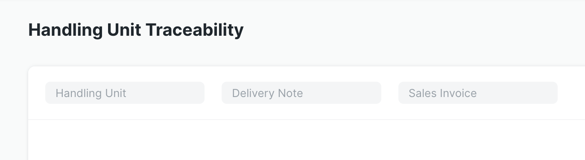

# Handling Unit Traceability Report

The Handling Unit Traceability report provides a simple interface to track a Handling Unit over its life cycle through your company's processes. Filters for the Handling Unit ID, Delivery Note name, and Sales Invoice name allow for fine-tuning of the report's results.

The following example shows the report output for a Handling Unit associated with finished Kaduka Key Lime Pies. There are three work orders to create the pie - the one shown at the top of the report is for assembling and baking the pie itself, the other two partially or not shown are for making the pie crust or the pie filling. The report shows the Voucher Type and Number, Item Code, Quantity, Warehouse, and Handling Unit (all grouped by Work Order) for all transactions that impact the Stock Ledger that included the given Handling Unit.

