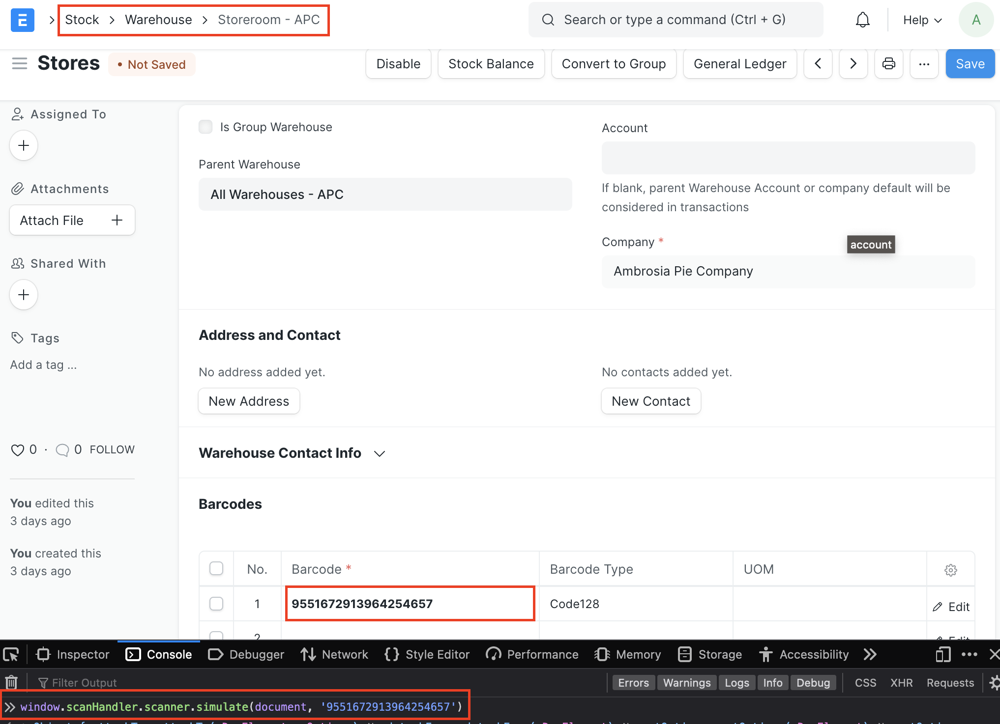
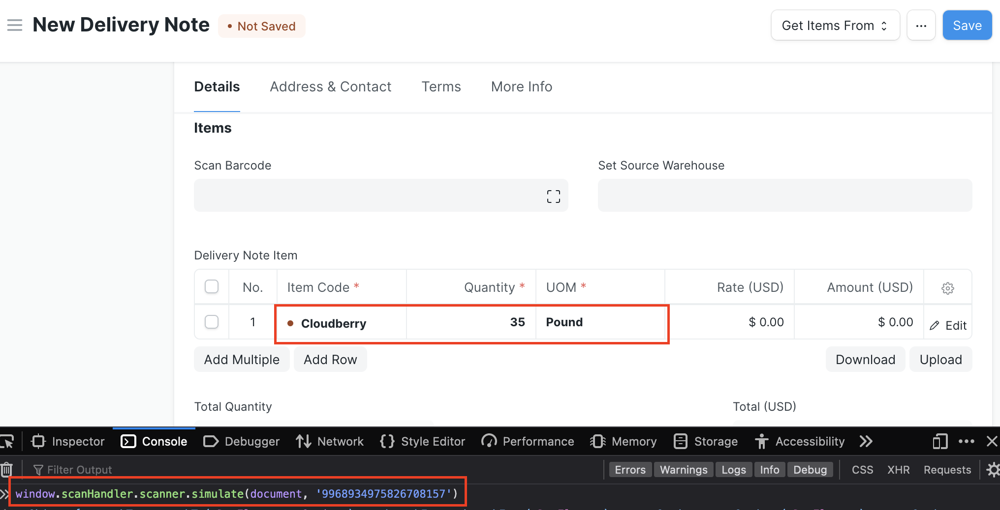
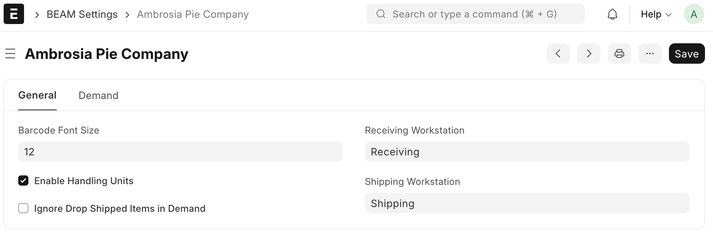
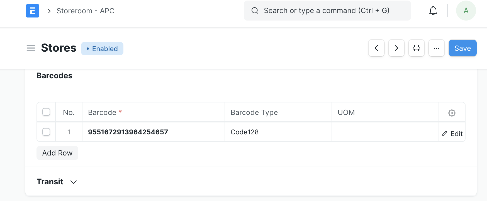

<!-- Copyright (c) 2024, AgriTheory and contributors
For license information, please see license.txt-->

# Beam

Beam is a general purpose 2D barcode scanning application for ERPNext.

## What does this application do?

Beam allows a user to scan a 2D barcode from either a listview or a form view, then helps enter data that would otherwise require numerous keystrokes. Unlike ERPNext's built-in barcode scanning, Beam expects the user to have a hardware barcode scanner connected to their device.

For example, if the user scans a barcode associated with an Item in the Item listview, it will take them to that item's record.

The following screen shot shows the outcome of simulating a scan from the browser's console using a barcode associated with the Stores warehouse. The browser automatically navigates to that warehouse page.

Read more about [how scanning in listviews works](./listview.md).

If the user scans an Item in a Delivery Note, it will populate everything it knows about that item, just as it would if they were to type in the item code. If they scan that item again, it will increment the last row with that item in it. The following screen shot shows a row for the Cloudberry item added in a new Delivery Note after simulating a scan from the browser's console of that item's Handling Unit barcode.

Read more about [how scanning in form views works](./form.md).

## Beam Settings

Beam's version 15 introduced a new Beam Settings document to allow users to opt in or out of features in the app. Settings are unique on a per-company basis and are automatically generated (with default options) during certain related transactions if a Beam Settings document doesn't already exist for the company. Related transactions include submission of a Purchase Receipt, Purchase Invoice, or Stock Entry.

Settings options include:

- **Company:** the company in ERPNext to apply the given settings to. One Beam Settings document may exist for each company in the system
- **Enable Handling Units:** (default checked) enables the generation of Handling Units (see What is a Handling Unit section for more information)

## What is a Handling Unit?

A Handling Unit is the combination of a container, any packaging material, and the items within or on it. This could be a pallet of raw materials used in a manufacturing process, a crate containing several other Handling Units, or a delivery vehicle transporting the crates and pallets.

Handling Units have unique, scannable identification numbers that are used in any stock transaction involving the items contained within the unit. The ID allows the user to reference everything about the stock transaction, saved from previous transactions. It also enables you to track the Handling Unit throughout its life cycle. The Beam application includes a [Handling Unit Traceability report](./hu_traceability_report.md) to summarize the transactions, related documents, quantities, and warehouses that involved a given Handling Unit.

A Handling Unit is generated when materials are received or created in the manufacturing process.

Read more [about Handling Units here](./handling_unit.md).

## Installation and Customization

Beam comes packed with features, but can be extended with custom hooks both on the server side and in the client as needed. See the following pages for detailed instructions on installing and customizing the application:

- [Installation](https://github.com/agritheory/beam)
- [Customization](./hooks.md)

## Warehouses

Warehouses may also have unique barcodes associated with them. The user can navigate to a given warehouse, add a row to the Barcodes table, then manually enter the code, type, and optionally the UOM.

## Print Server Integration

Beam offers the ability to print to raw input printers like Zebra printers directly from the browser. Also included are several debugging and example print formats. For more details about configuring this, see the [print server section](./print_server.md). 

## Roadmap and Planned Features

Feature requests, support requests and bug reports can be made via [GitHub Issues](https://github.com/agritheory/beam/issues).

To test the scanning functionality without actually having a hardware scanner, see the [testing section](./testing.md).
