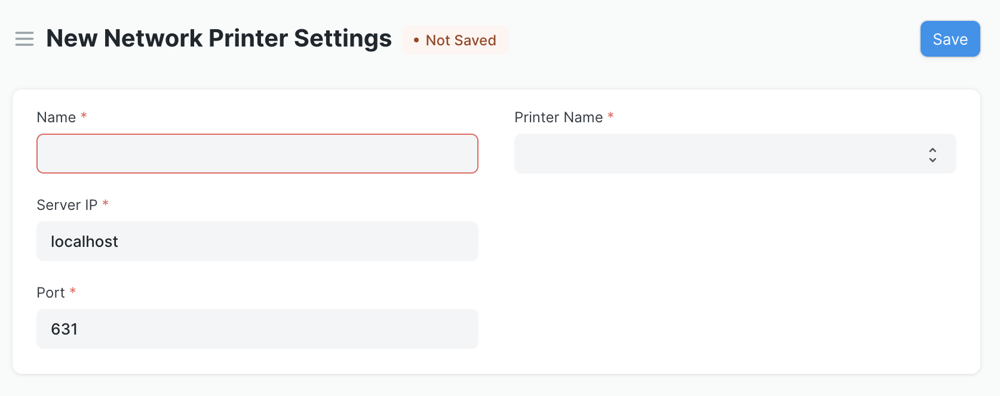
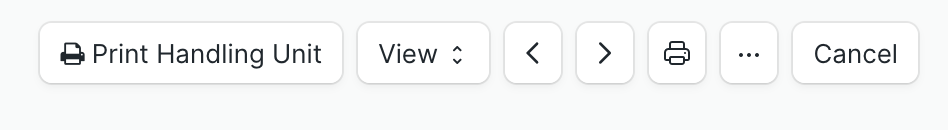
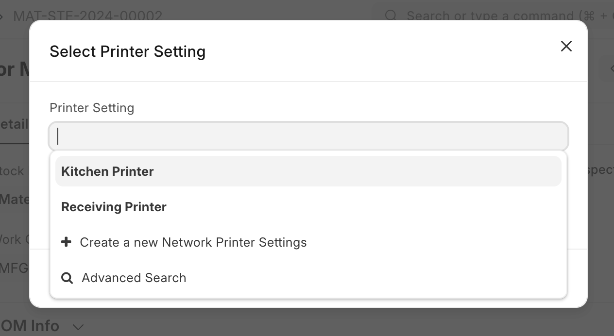

# Print Server

There are several steps to get a print server connected in ERPNext.

1. First, the `pycups` dependency needs to be installed on the system, which in turn depends on the CUPS project's `libcups` library. See the following links for installation instructions:
- [OpenPrinting CUPS installation and configuration instructions](https://github.com/OpenPrinting/cups/blob/master/INSTALL.md)
- [PyCUPS dependencies, compiling, and installation information](https://github.com/OpenPrinting/pycups)

2. Next, the user must add their Zebra printer to the CUPS server. This can be done by following the official CUPS documentation, which can be found [here](https://supportcommunity.zebra.com/s/article/Adding-a-Zebra-Printer-in-a-CUPS-Printing-System).

3. The user must also create a new `Network Printer Settings` document and fill in the relevant information.

A convenient Print Handling Unit button on relevant doctypes enables the user to print new Handling Unit labels directly from the ERPNext user interface.

Any configured network printers will display as options in the Select Printer Setting dialog.

