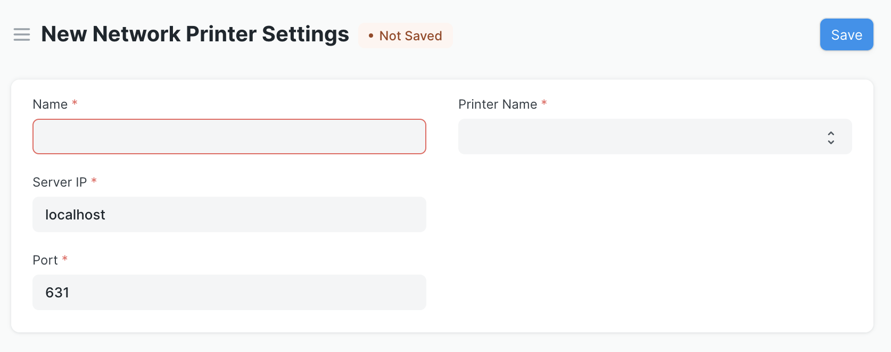
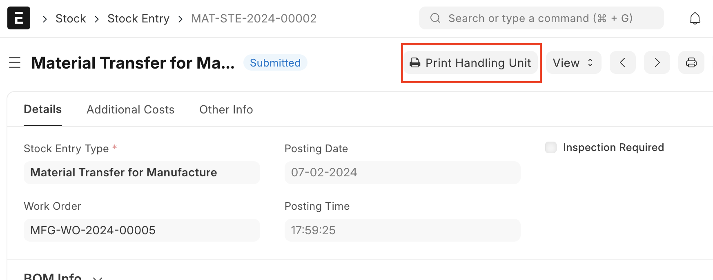
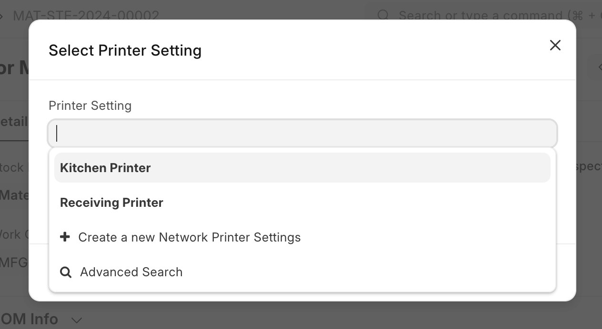

<!-- Copyright (c) 2025, AgriTheory and contributors
For license information, please see license.txt-->

# Print Server

<div class="byline">
  Rohan Bansal, Heather Kusmierz, and Tyler Matteson 2026-06-22
</div>


There are several steps to get a print server connected in ERPNext.

1. First, the `pycups` dependency needs to be installed on the system, which in turn depends on the CUPS project's `libcups` library. See the following links for installation instructions:
- [OpenPrinting CUPS installation and configuration instructions](https://github.com/OpenPrinting/cups/blob/master/INSTALL.md)
- [PyCUPS dependencies, compiling, and installation information](https://github.com/OpenPrinting/pycups)

2. Add the bench user to the `lpadmin` group when administering a local CUPS server: `sudo usermod -aG lpadmin {username}`. Use **Server IP** `localhost` (not `127.0.0.1`) so BEAM uses the CUPS Unix socket and admin operations work without HTTP authentication errors.

3. Add a network printer using the **Network Printer Settings** wizard (**New** opens a guided setup). The **Stock Manager** at **Ambrosia Pie Company** can register a ZD621 on the Chelsea receiving dock when **Chelsea Fruit Co** deliveries arrive — without opening the CUPS web UI. **Administrator** can repeat the wizard during go-live or link a queue that already exists on CUPS (for example `vRAW`).

4. The wizard walks through print server connection, discovery, queue details, and driver selection. Discovery shows network printers and existing CUPS queues, sorted with unconfigured entries first. Use **Test Connection** on the discovery and details steps to ping the host and verify the device URI before creating the queue. USB printers are not supported.



The friendly **Network Printer Settings** name (for example **Chelsea Receiving Labels**) is separate from the CUPS queue name (for example `ZD621`). The **Printer Name** field on the full form is an autocomplete that queries the configured CUPS server and displays available printers by their CUPS identifier, with the physical **Printer Location** and make/model shown as secondary text (location first when set). Selecting a printer automatically fills in **Printer Location** from CUPS. The location can be edited freely — saving the record pushes the updated value back to CUPS, keeping the two in sync. **Printer Location** also appears in the list view for fleet management. The **Printer Type** field (`General Purpose` or `Label / RAW`) distinguishes PDF printers from ZPL/raw label printers.

Saved records show a live **CUPS status** panel (idle/processing/offline indicator, make/model, CUPS description, accepting jobs).

On a saved record, **Administrator** can use:

| Action | Purpose |
|--------|---------|
| **Configure Printer** | Change device URI, driver (PPD), location, enabled state, and accepting jobs |
| **Sync from CUPS** | Pull the latest location and device URI from the print server |
| **Print Test** | Submit a ZPL test label for **Label / RAW** queues, or a CUPS/text test for **General Purpose** |
| **Printer Options** | View and set CUPS driver defaults (General Purpose only) |
| **Ping Printer** | Ping the host extracted from the device URI |
| **Delete from CUPS** | Remove the queue and ERPNext record when decommissioning hardware |

Use the **Printer Fleet Status** report to compare CUPS queues against ERPNext records (synced, orphan, missing, mismatch) across print servers.

## Testing (CUPS container)

Integration tests start the published CUPS container via testcontainers (Docker required):

```bash
pytest beam/beam/tests/test_printer_logic.py
pytest beam/beam/tests/test_printer_cups_integration.py
```

Locally the fixture builds from [`cups/cups/Containerfile`](../../cups/cups/Containerfile). In CI, set `BEAM_CUPS_IMAGE` to the GHCR tag built in the same pipeline (for example `ghcr.io/agritheory/beam-cups:sha-<git-sha>`). Optional env vars: `CUPS_ADMIN_USER`, `CUPS_ADMIN_PASSWORD` (defaults match `cups/.env.example`).

Pure logic tests run without CUPS. Integration tests use `test_utils.printers` mock servers (TCP raw + IPP) plus real pycups/CUPS queue creation against the container on a mapped HTTP port.

---

A convenient Print Handling Unit button on relevant doctypes enables the user to print new Handling Unit labels directly from the ERPNext user interface.



Any configured network printers will display as options in the Select Printer Setting dialog.


