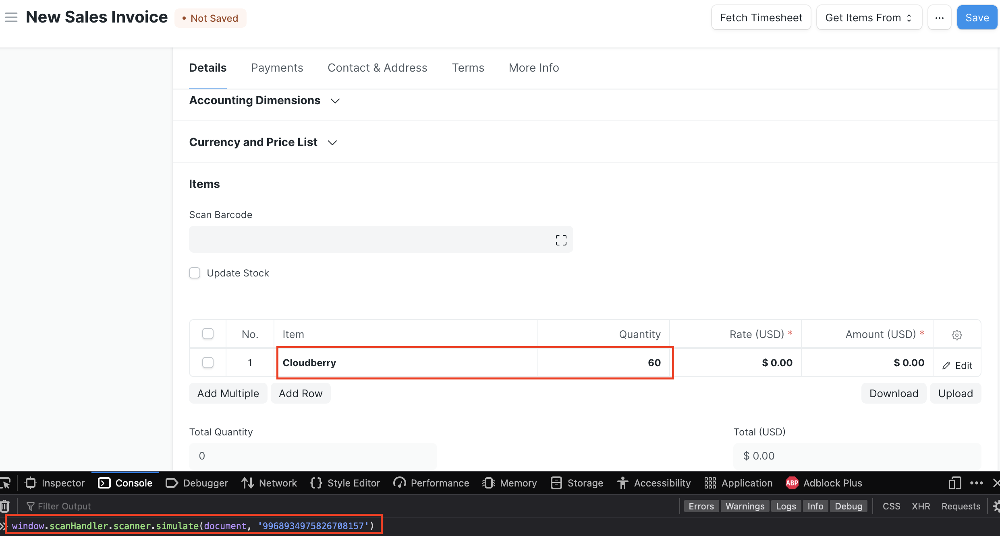

<!-- Copyright (c) 2024, AgriTheory and contributors
For license information, please see license.txt-->

# Testing

## Simulating a Scanner

Open the browser console. This assumes a barcode of `'9968934975826708157'` which must be sent as a string.

```js
window.scanHandler.scanner.simulate(document, '9968934975826708157')
```



## About the Test Suite

Coming soon
